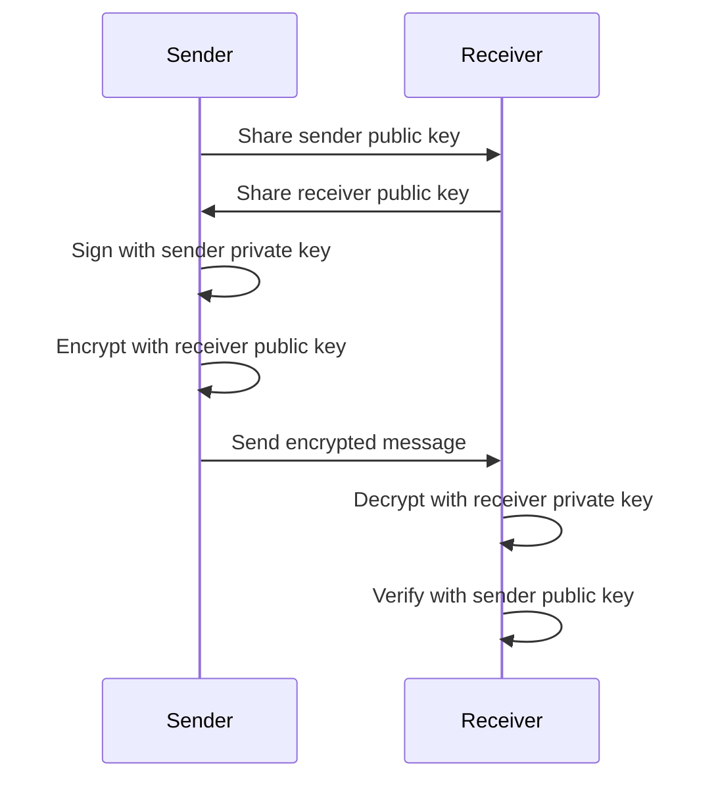

## Introduction

This is an example of using Bouncy Castle's OpenPGP utility to encrypt and decrypt files, and to
generate public and private key pairs programmatically in Java, without GnuPG.

This project is a refactory of the Bouncy Castle `KeyBasedLargeFileProcessor` example, which you can
find in the [bc-java repository](https://github.com/bcgit/bc-java/blob/main/misc/src/main/java/org/bouncycastle/openpgp/examples/KeyBasedLargeFileProcessor.java).

## Requirements

- Java 21 or later
- Maven 3.6.3 or later
- Bouncy Castle 1.86 (`bcpg-jdk18on` / `bcprov-jdk18on`), pulled in by Maven

The Bouncy Castle provider is passed directly to the operator builders, so there is no need to
call `Security.addProvider(new BouncyCastleProvider())` before using these classes.

Encrypted files use AES-256 with an integrity check (MDC) enabled by default, and signatures use
SHA-256.

## How the sender and receiver keys are used
Each side has its own key pair, keeps its private key, and shares only its public key. The
sender signs with its own private key and encrypts with the receiver's public key. The receiver
decrypts with its own private key and verifies with the sender's public key.



## Code snippet to encrypt a file without signing

        BCPGPEncryptor encryptor = new BCPGPEncryptor();
        encryptor.setArmored(false);
        encryptor.setCheckIntegrity(true);
        encryptor.setPublicKeyFilePath("./receiver.gpg.pub");
        encryptor.encryptFile("./test.txt", "./test.txt.enc");

## Code snippet to decrypt a file without verifying signature

        BCPGPDecryptor decryptor = new BCPGPDecryptor();
        decryptor.setPrivateKeyFilePath("receiver.gpg.prv");
        decryptor.setPassword("password");
        decryptor.decryptFile("test.txt.enc", "test.txt.dec");

## Code snippet to encrypt and sign a file

        BCPGPEncryptor encryptor = new BCPGPEncryptor();
        encryptor.setArmored(false);
        encryptor.setCheckIntegrity(true);
        encryptor.setPublicKeyFilePath("./receiver.gpg.pub");
        encryptor.setSigning(true);
        encryptor.setSigningPrivateKeyFilePath("sender.gpg.prv");
        encryptor.setSigningPrivateKeyPassword("password");
        encryptor.encryptFile("./test.txt", "./test.txt.signed.enc");

## Code snippet to decrypt a file and verify signature

        BCPGPDecryptor decryptor = new BCPGPDecryptor();
        decryptor.setPrivateKeyFilePath("receiver.gpg.prv");
        decryptor.setPassword("password");
        decryptor.setSigned(true);
        decryptor.setSigningPublicKeyFilePath("sender.gpg.pub");

        // this file is encrypted with the receiver public key and signed with the sender private key
        decryptor.decryptFile("test.txt.signed.enc", "test.txt.signed.dec");

## Code snippet to generate a public and private key pair

        BCPGPKeyGenerator generator = new BCPGPKeyGenerator();
        generator.setIdentity("Alice <alice@example.com>");
        generator.setPassword("password");
        generator.setArmored(true);  // false writes binary keys, like the ones in src/test/resources
        generator.generateKeys("alice.gpg.pub.asc", "alice.gpg.prv.asc");

The key pair has the same shape as the one `gpg --gen-key` makes: an RSA-3072 primary key for
signing and an RSA-3072 subkey for encryption (`setKeySize` changes both). The private key is
protected with the password using AES-256. The public key file works with
`setPublicKeyFilePath` / `setSigningPublicKeyFilePath` above, the private key file with
`setPrivateKeyFilePath` / `setSigningPrivateKeyFilePath`, and GnuPG can import both.

## Try it
`src/main/java/com/test/pgp/bc/BCPGPTest.java` is a runnable example that goes through every
snippet above, in binary and ASCII-armored form, decrypts a message GnuPG 1.4.9 made in 2011,
and generates a new key pair, prints it, and encrypts and decrypts with it. Run it from the
project root; its output goes to `target/`:

        mvn clean compile exec:java

The unit tests in `src/test/java/com/test/pgp/bc/BCPGPEncryptorDecryptorTest.java` cover the
same scenarios plus failure cases (tampered message, wrong password, missing or unknown
signature). `BCPGPKeyGeneratorTest` checks that generated keys work with the encryptor and
decryptor. They write to a temporary directory that is deleted afterwards:

        mvn clean test

The keys and input files are in `src/test/resources`. The keys are for testing only; never
use them to protect real data.

| Files | Key | Passphrase |
|-------|-----|------------|
| `receiver.gpg.pub` / `receiver.gpg.prv` | receiver, RSA-3072: messages are encrypted to it and it decrypts them | `password` |
| `sender.gpg.pub` / `sender.gpg.prv` | sender, RSA-3072: signs messages | `password` |
| `legacy-receiver.gpg.prv` / `legacy-sender.gpg.pub` | the original 2011 DSA/ElGamal keys, kept only to decrypt and verify `legacy-test.txt.signed.asc` | `password` for the key that file uses |
| `test.txt` | the file the tests encrypt | |

## High-level OpenPGP API (`openpgp-api` branch)
The classes on `master` use Bouncy Castle's low-level OpenPGP classes (`PGPEncryptedDataGenerator`,
`PGPObjectFactory` and so on). Bouncy Castle also has a high-level API,
`org.bouncycastle.openpgp.api`, and the `openpgp-api` branch tries it out:

        git switch openpgp-api
        mvn clean test

The branch adds:

- `OpenPGPApiCrypto`: the same encrypt/sign and decrypt/verify operations in about a third of
  the code. The API chooses the encryption subkey, negotiates algorithms, and checks keys and
  signatures against a security policy.
- `OpenPGPApiCryptoTest`: round trips in binary and ASCII-armored form, failure cases,
  interoperability in both directions with `BCPGPEncryptor` / `BCPGPDecryptor`, and a round
  trip with Ed25519 / X25519 keys generated in code.

Things to know about the high-level API:

- Its default policy rejects weak keys and algorithms. The 2011 DSA-1024 / ElGamal keys and the
  SHA-1 signature in `legacy-test.txt.signed.asc` are refused unless you pass a relaxed
  `OpenPGPDefaultPolicy`; the branch's tests show how.
- `OpenPGPDocumentSignature.isValid()` with no arguments checks against the default policy,
  not the one you configured; pass your policy explicitly.
- `OpenPGPKeyGenerator.build(char[])` wipes the passphrase array you give it, so don't reuse it.

## Creating the test keys
You can create keys in Java or with GnuPG. Both give an RSA-3072 signing primary key with an
RSA-3072 encryption subkey, and keys from either one work with the classes above.

### In Java
`BCPGPKeyGenerator` creates a key pair programmatically, with no GnuPG install needed. For
example, to create binary keys like the ones in `src/test/resources`:

        BCPGPKeyGenerator generator = new BCPGPKeyGenerator();
        generator.setIdentity("receiver (test key) <receiver@example.com>");
        generator.setPassword("password");
        generator.generateKeys("receiver.gpg.pub", "receiver.gpg.prv");

`BCPGPKeyGenerator` is a thin wrapper. The Bouncy Castle code it runs looks like this,
condensed (see `src/main/java/com/test/pgp/bc/BCPGPKeyGenerator.java` for the full version with
imports):

        Provider bc = new BouncyCastleProvider();
        Date now = new Date();

        // 1. Generate two RSA key pairs: the primary key signs, the subkey encrypts
        KeyPairGenerator kpg = KeyPairGenerator.getInstance("RSA", bc);
        kpg.initialize(3072);
        PGPKeyPair primaryKey = new JcaPGPKeyPair(PublicKeyPacket.VERSION_4,
                PublicKeyAlgorithmTags.RSA_GENERAL, kpg.generateKeyPair(), now);
        PGPKeyPair encryptionKey = new JcaPGPKeyPair(PublicKeyPacket.VERSION_4,
                PublicKeyAlgorithmTags.RSA_GENERAL, kpg.generateKeyPair(), now);

        // 2. Say what each key is for, and which algorithms senders should use
        PGPSignatureSubpacketGenerator primaryFlags = new PGPSignatureSubpacketGenerator();
        primaryFlags.setKeyFlags(true, KeyFlags.CERTIFY_OTHER | KeyFlags.SIGN_DATA);
        primaryFlags.setPreferredSymmetricAlgorithms(false, new int[] {SymmetricKeyAlgorithmTags.AES_256});
        primaryFlags.setPreferredHashAlgorithms(false, new int[] {HashAlgorithmTags.SHA512});
        primaryFlags.setFeature(false, Features.FEATURE_MODIFICATION_DETECTION);
        PGPSignatureSubpacketGenerator encryptionFlags = new PGPSignatureSubpacketGenerator();
        encryptionFlags.setKeyFlags(true, KeyFlags.ENCRYPT_COMMS | KeyFlags.ENCRYPT_STORAGE);

        // 3. Bind the user ID and subkey to the primary key; protect the secret keys with a password
        PGPDigestCalculatorProvider digests =
                new JcaPGPDigestCalculatorProviderBuilder().setProvider(bc).build();
        PGPKeyRingGenerator generator = new PGPKeyRingGenerator(
                PGPSignature.POSITIVE_CERTIFICATION,
                primaryKey,
                "Alice <alice@example.com>",
                digests.get(HashAlgorithmTags.SHA1),  // secret key checksum, required for v4 keys
                primaryFlags.generate(),
                null,
                new JcaPGPContentSignerBuilder(PublicKeyAlgorithmTags.RSA_GENERAL,
                        HashAlgorithmTags.SHA256).setProvider(bc),
                new JcePBESecretKeyEncryptorBuilder(SymmetricKeyAlgorithmTags.AES_256,
                        digests.get(HashAlgorithmTags.SHA256)).setProvider(bc)
                        .build("password".toCharArray()));
        generator.addSubKey(encryptionKey, encryptionFlags.generate(), null);

        // 4. Write the public key and the secret key, ASCII-armored
        //    (ArmoredOutputStream.close() does not close the file, so close it separately)
        try (OutputStream file = new FileOutputStream("alice.gpg.pub.asc");
                OutputStream out = new ArmoredOutputStream(file)) {
            generator.generatePublicKeyRing().encode(out);
        }
        try (OutputStream file = new FileOutputStream("alice.gpg.prv.asc");
                OutputStream out = new ArmoredOutputStream(file)) {
            generator.generateSecretKeyRing().encode(out);
        }

A few settings differ from GnuPG's. The private key is protected with AES-256 and SHA-256
rather than AES-128 and SHA-1, but Bouncy Castle's default password hashing count (65,536) is
much lower than GnuPG's (about 27 million), so a stolen private key file is cheaper to
brute-force. That is fine for test keys; use a strong password for real ones.

### With GnuPG
The `receiver` and `sender` keys in `src/test/resources` were created with GnuPG 2.x. To create
them again (or make your own), run the following from `src/test/resources` in a bash shell (on
Windows, Git Bash works). A throwaway GnuPG home directory is used so your own keyring is not
touched.

```bash
export GNUPGHOME=$(mktemp -d)
echo allow-loopback-pinentry > "$GNUPGHOME/gpg-agent.conf"

# generate a key pair: RSA-3072 signing primary key + RSA-3072 encryption subkey
gen_key() {
gpg --batch --pinentry-mode loopback --gen-key <<EOF
Key-Type: RSA
Key-Length: 3072
Key-Usage: sign
Subkey-Type: RSA
Subkey-Length: 3072
Subkey-Usage: encrypt
Name-Real: $1
Name-Comment: test key
Name-Email: $2
Expire-Date: 0
Passphrase: password
%commit
EOF
}
gen_key receiver receiver@example.com
gen_key sender sender@example.com

# export the keys in binary format; secret key exports need the passphrase
gpg --export receiver@example.com > receiver.gpg.pub
gpg --batch --pinentry-mode loopback --passphrase password \
    --export-secret-keys receiver@example.com > receiver.gpg.prv
gpg --export sender@example.com > sender.gpg.pub
gpg --batch --pinentry-mode loopback --passphrase password \
    --export-secret-keys sender@example.com > sender.gpg.prv

# clean up the throwaway home directory
gpgconf --kill gpg-agent
rm -rf "$GNUPGHOME"
unset GNUPGHOME
```

Notes:
- `--pinentry-mode loopback` with `--passphrase` passes the passphrase on the command line,
  so gpg does not open a passphrase popup. This is fine for test keys; don't do it for real
  keys, because the passphrase ends up in your shell history.
- Add `--armor` to the export commands to get ASCII-armored keys. The code reads both
  formats.
- `BCPGPUtils.readPublicKey` uses the first key in the file that is flagged for encryption,
  so keep one key ring per public key file.
